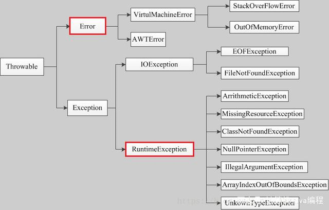

# Throwable
当我们讨论Spring事务时，就需要考虑异常。
如果是受检异常，必须显示声明，否则事务时不会回滚的

## Unchecked Exception:
a. 指的是程序的瑕疵或逻辑错误，并且在运行时无法恢复。

b. 包括Error与RuntimeException及其子类，如：OutOfMemoryError, UndeclaredThrowableException, IllegalArgumentException, IllegalMonitorStateException, NullPointerException, IllegalStateException, IndexOutOfBoundsException等。

c. 语法上不需要声明抛出异常。

## Checked Exception:
a. 代表程序不能直接控制的无效外界情况（如用户输入，数据库问题，网络异常，文件丢失等）

b. 除了Error和RuntimeException及其子类之外，如：ClassNotFoundException, NamingException, ServletException, SQLException, IOException等。

c. 需要try catch处理或throws声明抛出异常。

作者：鱼仔_1625
链接：https://www.jianshu.com/p/1256415772bb
来源：简书
著作权归作者所有。商业转载请联系作者获得授权，非商业转载请注明出处。
